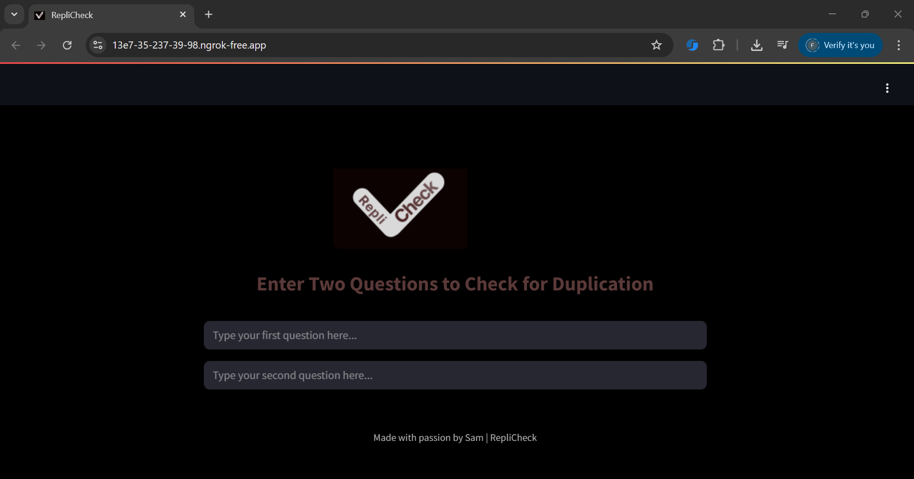

Here's a **detailed and well-structured README** for your project. This README provides a comprehensive overview of your project, including setup instructions, usage, and a detailed explanation of the code.

---

# RepliCheck: Question Duplication Detection

**RepliCheck** is a web application designed to detect whether two input questions are duplicates. This is achieved through machine learning models trained to identify the semantic similarity between text pairs. The app is built with **Streamlit** for an interactive user experience and uses a **pre-trained model** for predictions.

## Table of Contents

1. [Overview](#overview)
2. [Features](#features)
3. [Technologies Used](#technologies-used)
4. [Installation](#installation)
5. [Usage](#usage)
6. [Project Structure](#project-structure)
7. [Model Training](#model-training)
8. [Deployment](#deployment)
9. [Contributing](#contributing)
10. [License](#license)

## Overview

RepliCheck aims to automate the detection of duplicate questions in various platforms, such as **Q\&A websites**, **forums**, and **chatbots**. The application allows users to input two questions and quickly see if they are duplicates or not based on a pre-trained model.

### Key Features:

* **Question Duplication Detection:** Using a machine learning model to predict if two questions are duplicates.
* **Streamlit Web Interface:** A user-friendly web interface to interact with the model.
* **Interactive Predictions:** Users input questions and immediately see results.

---

## Technologies Used

* **Streamlit**: A Python library to create interactive web applications.
* **Python**: The primary programming language for data processing and model training.
* **Pickle**: Used for saving and loading the trained machine learning model.
* **scikit-learn**: For model training and evaluation.
---

## Installation

To run the RepliCheck application locally, follow these steps:

### Prerequisites

* **Python 3.6+** (preferably 3.7 or above)
* **Streamlit**: `pip install streamlit`
* **Scikit-learn**: `pip install scikit-learn`
* **Pickle** (part of Python standard library, no need to install)
* **Other dependencies** listed in `requirements.txt`

### Steps

1. **Clone the repository**:

   git clone https://github.com/your-username/replcheck.git
   cd replcheck
   
2. **Install dependencies**:
   Create a virtual environment and activate it (optional but recommended):

   python3 -m venv venv
   source venv/bin/activate  # On Windows, use venv\Scripts\activate

Then install the dependencies:

pip install -r requirements.txt

3. **Run the app**:
   streamlit run app.py

4. Open your browser and visit `http://localhost:8501` to interact with the app.

---

## Usage

Once the app is running:

1. **Enter Two Questions**: Type your two questions in the input boxes on the app interface.
2. **View Results**: After entering both questions, the app will predict whether they are duplicates or not based on the trained model.

---

## Project Structure

Here’s the structure of the repository:

│
├── app.py                 # Streamlit web app to interact with the model
├── helper.py              # Helper functions used in app.py (e.g., text preprocessing)
├── model.pkl              # Trained machine learning model (saved with Pickle)
├── requirements.txt       # List of Python dependencies
├── Component 7-2.png      # Logo image for the web app
└── README.md              # This README fil

---

## Model Training

The model used for duplicate question detection is based on **Text Classification**. Here’s an overview of the training process:

1. **Data Preprocessing**:

   * Text normalization: Lowercasing, removing stopwords, punctuation, etc.
   * Tokenization: Splitting questions into individual tokens for processing.

2. **Feature Extraction**:

   * TF-IDF (Term Frequency-Inverse Document Frequency) vectors were generated from the preprocessed text to convert the text into numerical format.

3. **Model Training**:

   * The dataset consists of pairs of questions, and the model predicts whether the pair is a duplicate.
   * A machine learning classifier (e.g., **Logistic Regression**, **Random Forests**, or **SVM**) is trained using scikit-learn.

4. **Model Evaluation**:

   * The model was evaluated on a validation set, and performance metrics like **accuracy** were computed.

---

## Deployment

This app can be deployed on platforms like **Streamlit Cloud**, **Heroku**, or **AWS**. For local deployment:

1. The app is built using **Streamlit**, which allows you to create a web app that runs on your local machine.
2. The trained model is loaded using Pickle (`model.pkl`).
3. Custom **CSS** is added to style the app with a dark theme, providing a better user experience.

For **cloud deployment**, follow these steps:

* **Streamlit Cloud**: Upload the repository and deploy directly.
* **Heroku**: Push the repository to a Heroku app for deployment.

---

## Contributing

We welcome contributions to improve the project! You can contribute in the following ways:

* **Fork the repository** and submit a pull request with bug fixes or new features.
* **Report issues** by creating an issue on GitHub.
* **Suggest improvements** for better performance or usability.

### Contact:

* **Creator**: Samardeep Singh
* **Email**: samareduforcollege@gmail.com

---

This README file ensures anyone can understand your project, set it up, and contribute. Would you like to adjust anything in this or add more details?
